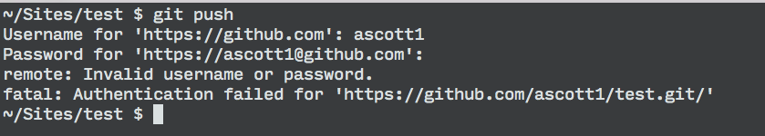
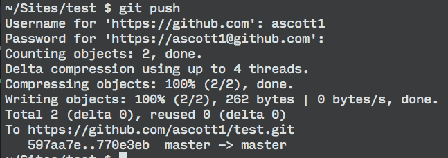

# GitHub, two-factor auth, and https

When cloning a GitHub repo over HTTPS, you will be prompted to enter your username and password on each push. If you're using two-factor authorization, you may discover that entering your password throws an error.

To solve this problem, you can use a "Personal Access Token" from GitHub. To obtain the token:

1. Go to [the tokens section](https://github.com/settings/tokens) of your GitHub profile settings.
2. Click the "Generate a New Token" button.
3. Give the token a description and click "Generate Token," leaving the scopes at the default settings.
4. Copy the token value.
5. Back in your terminal, paste the token value when prompted for your password. Note, that there will be no visible input when you paste the value.

Success!

Entering your access token on every push could become a bit tedious, particularly since they need to be regenerated regularly. GitHub has a guide on [caching your GitHub password](https://help.github.com/articles/caching-your-github-password-in-git/#platform-all) for some time. If you're using two-factor auth (which is great!), I suggest going through the process of generating [SSH keys](https://help.github.com/articles/generating-ssh-keys/) for your account. This will allow you to push without the need for a password or entering the authorization token.
